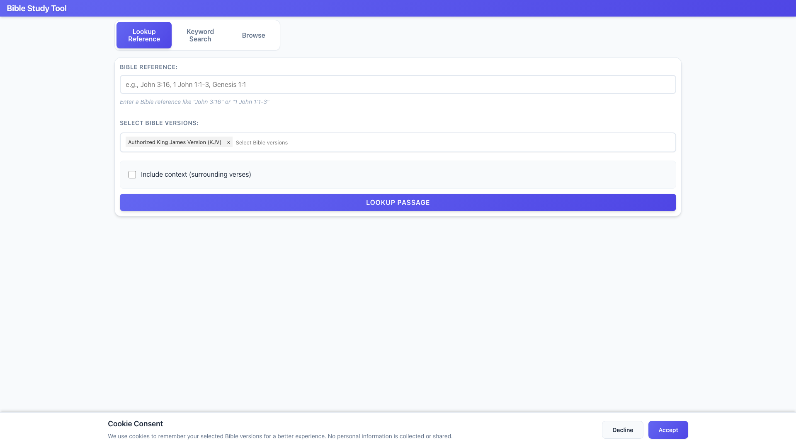
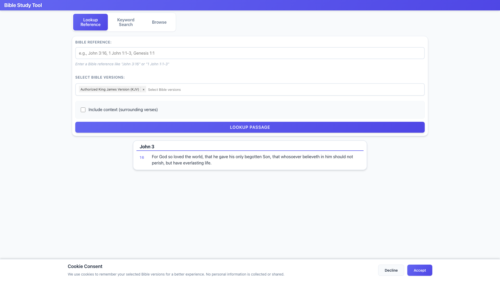
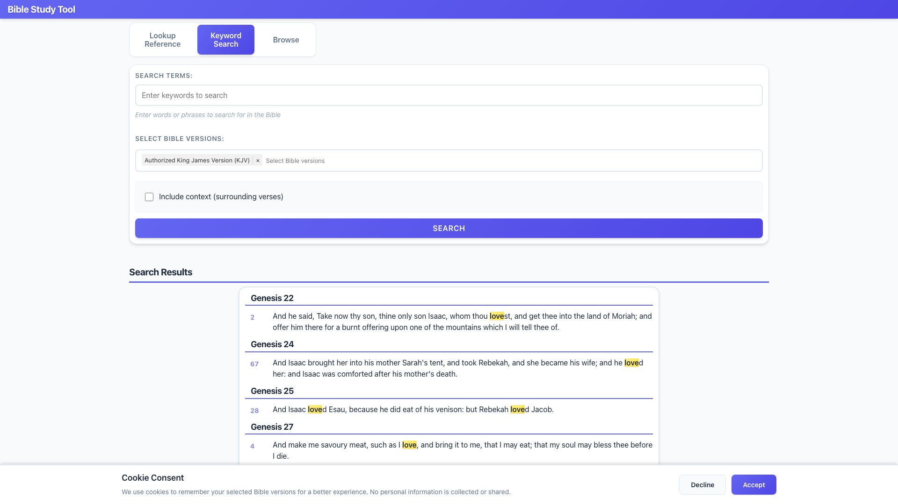
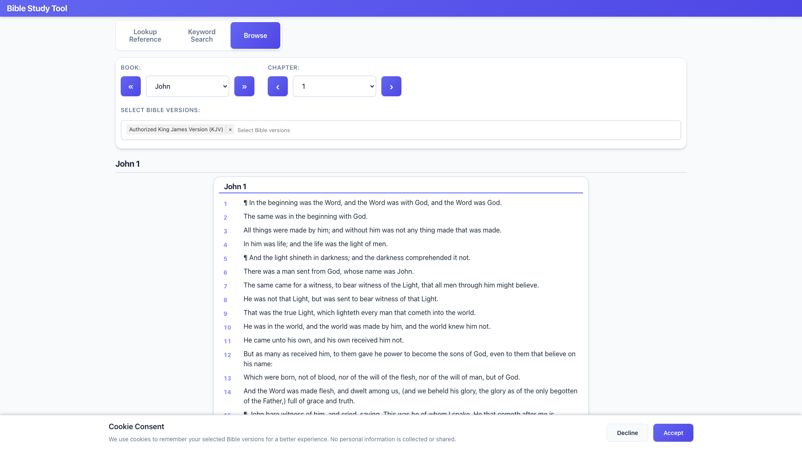
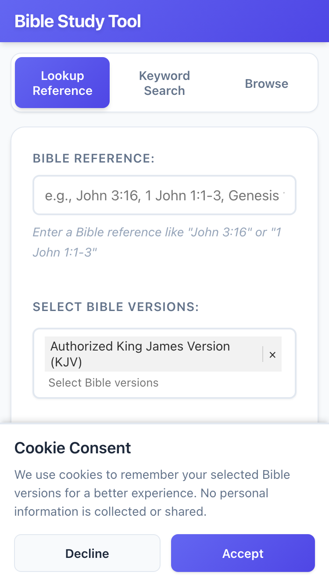

# Bible Study Tool

A standalone website that interfaces with the BibleSuperSearch API for searching and reading Bible passages. This is a client-side React application that requires no backend server beyond API communication.

## Important Disclaimer

**This project is not affiliated with, endorsed by, or associated with BibleSuperSearch.** This is an independent frontend application that strictly consumes the BibleSuperSearch API. BibleSuperSearch is a separate service, and this project does not provide, maintain, or support the BibleSuperSearch API itself.

If you need support for your BibleSuperSearch API installation, please visit [BibleSuperSearch Downloads](https://www.biblesupersearch.com/downloads/) to purchase a support license. BibleSuperSearch offers priority support licenses for their API and client software.

## Features

- **Bible Reference Lookup**: Look up passages by reference (e.g., "John 3:16", "1 John 1:1-3")
- **Keyword Search**: Search for keywords or phrases across the Bible
- **Bible Browsing**: Browse through books and chapters with navigation controls
- **Multiple Bible Versions**: Select and compare multiple Bible translations
- **Parallel Display**: View passages from multiple versions side-by-side
- **Search Highlighting**: Highlighted search terms in results
- **Context Options**: Include surrounding verses for context with configurable range
- **Internationalization**: Full translation support for 27 languages with automatic detection
- **Cookie-based Preferences**: Remember selected Bible versions (with consent)
- **URL State Management**: Bookmarkable and shareable links for any passage or search
- **Language-based Defaults**: Automatically selects appropriate Bible version based on browser language
- **Responsive Design**: Works on desktop and mobile devices

## Screenshots

### Main Interface

*The main interface showing all three tabs: Lookup Reference, Keyword Search, and Browse*

### Lookup Reference

*Looking up a Bible passage by reference (e.g., "John 3:16")*

### Search Results

*Keyword search results with highlighted search terms*

### Parallel Bible View

*Comparing multiple Bible translations side-by-side*

### Browse Tab

*Browsing through books and chapters with navigation controls*

### Mobile View

*Responsive design optimized for mobile devices*

> **📸 Taking Screenshots** 
> 
> We've included an automated screenshot tool! To generate screenshots:
> 
> 1. **Start the development server:**
>    ```bash
>    npm run dev
>    ```
> 
> 2. **In another terminal, run the automated script:**
>    ```bash
>    npm run screenshots
>    ```
> 
> This will automatically capture all screenshots and save them to `docs/screenshots/`.
> 
> For manual screenshots or more details, see:
> - [scripts/README.md](scripts/README.md) - Automated screenshot script documentation
> - [docs/SCREENSHOTS.md](docs/SCREENSHOTS.md) - Manual screenshot guidelines

## Prerequisites

- Node.js (v16 or higher)
- npm or yarn
- Access to a running BibleSuperSearch API instance

## Quick Start

1. **Clone the repository:**
   ```bash
   git clone https://github.com/alephcom/bible_study.git
   cd bible_study
   ```

2. **Install dependencies:**
   ```bash
   npm install
   ```

3. **Configure API URL:**
   
   Create a `.env` file in the root directory:
   ```bash
   cp .env.example .env
   ```
   
   Edit `.env` and set your BibleSuperSearch API URL:
   ```bash
   VITE_API_BASE_URL=http://localhost/api
   ```
   
   Replace `http://localhost/api` with your actual BibleSuperSearch API URL.
   
   - If your API is at `https://your-api-domain.com`, set:
     ```
     VITE_API_BASE_URL=https://your-api-domain.com/api
     ```
   
   - If running locally at `http://localhost`, set:
     ```
     VITE_API_BASE_URL=http://localhost/api
     ```

4. **Start development server:**
   ```bash
   npm run dev
   ```
   
   The app will open at `http://localhost:3000`

## Building for Production

Build the production bundle:

```bash
npm run build
```

The built files will be in the `dist/` directory and can be served by any static web server.

Preview the production build:

```bash
npm run preview
```

## Project Structure

```
bible_study/
├── public/                 # Static assets
├── src/
│   ├── components/         # React components
│   │   ├── Layout/        # Layout components
│   │   ├── BibleSelector/ # Bible version selector
│   │   ├── SearchForm/    # Search interface
│   │   ├── SearchPage/    # Main search/browse page
│   │   ├── PassageDisplay/# Passage rendering
│   │   ├── SearchResults/ # Search results display
│   │   └── CookieConsent/ # Cookie consent banner
│   ├── i18n/              # Internationalization
│   │   ├── config.js      # i18n configuration
│   │   └── locales/       # Translation files (27 languages)
│   ├── services/          # API service layer
│   │   └── api.js         # API client
│   ├── utils/             # Utility functions
│   │   ├── cookies.js     # Cookie management
│   │   ├── formatters.js  # Text formatting
│   │   ├── bibleInfo.js   # Bible information utilities
│   │   ├── language.js    # Language detection
│   │   └── urlState.js    # URL state management
│   ├── styles/            # Global styles
│   ├── App.jsx            # Main app component
│   └── main.jsx           # Entry point
├── index.html
├── vite.config.js
├── package.json
├── CHANGELOG.md           # Project changelog
└── README.md              # This file
```

## API Configuration

The application needs to connect to a running BibleSuperSearch API instance.

This application communicates with the BibleSuperSearch API. The API endpoints used are:

- `/api/query` - Main query endpoint for searches and passage lookups
- `/api/bibles` - Get list of available Bible versions
- `/api/books` - Get list of Bible books
- `/api/strongs` - Strong's number definitions

Note: The API also supports `/api/v2/{action}` endpoints, but versioning is not yet implemented - both routes point to the same controller.

Make sure your API base URL is correctly configured in the `.env` file.

### BibleSuperSearch API Support

If you need help with your BibleSuperSearch API installation, configuration, or troubleshooting, please purchase a support license from [BibleSuperSearch Downloads](https://www.biblesupersearch.com/downloads/). This project cannot provide support for the BibleSuperSearch API itself.

## Usage

1. **Select Bible Versions**: Use the Bible selector to choose one or more Bible translations (grouped by language)
2. **Lookup by Reference**: Use the "Lookup Reference" tab and enter a Bible reference (e.g., "John 3:16", "1 John 1:1-3")
3. **Search by Keywords**: Use the "Keyword Search" tab and enter search terms
4. **Browse the Bible**: Use the "Browse" tab to navigate through books and chapters with Previous/Next buttons
5. **View Results**: Passages are displayed in a formatted, easy-to-read layout
6. **Parallel Comparison**: When multiple versions are selected, view them side-by-side with version labels
7. **Share Links**: Copy the URL to share or bookmark any passage or search result
8. **Language Support**: The interface automatically adapts to your browser's language (27 languages supported)

## Browser Support

- Chrome (latest)
- Firefox (latest)
- Safari (latest)
- Edge (latest)

## Changelog

See [CHANGELOG.md](CHANGELOG.md) for a list of changes and version history.

## License

MIT License - See LICENSE file for details

## Credits

This project consumes the [BibleSuperSearch API](https://www.biblesupersearch.com) but is not affiliated with BibleSuperSearch.

### BibleSuperSearch Support

If you need support for your BibleSuperSearch installation (API, client software, or WordPress plugin), please visit [BibleSuperSearch Downloads](https://www.biblesupersearch.com/downloads/) to purchase a support license.

This project is an independent frontend application and cannot provide support for BibleSuperSearch software or API issues.
